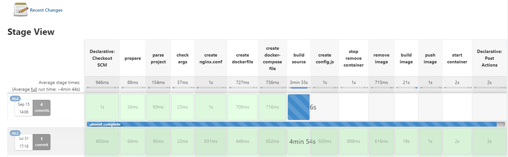
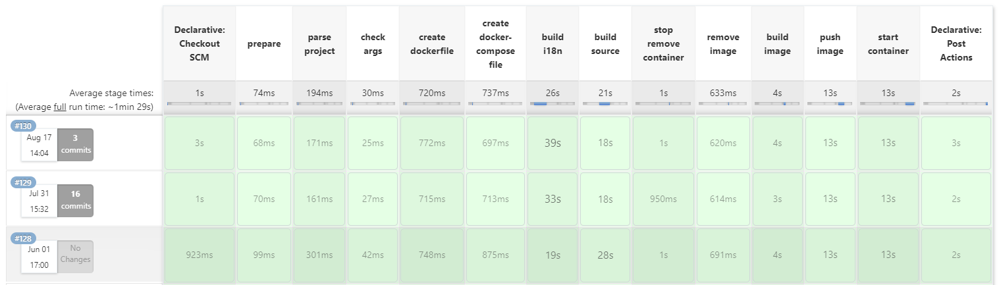
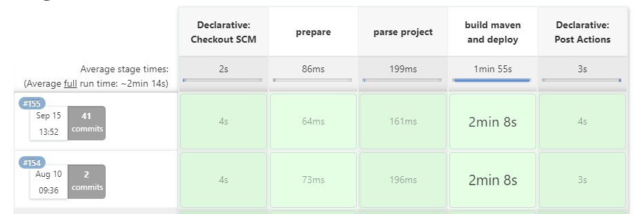

## HiraethCI 项目说明
在我们工作中经常使用Jenkins来构建前后端项目，而每当构建一个项目时都需编写一次构建脚本Jenkinsfile，其中大部分脚本基本一致。该项目的出现就是为了简化这部分工作，使得项目使用者可以更加专注于实际构建及部署流程，无需在多个项目中重复编码。该插件也是基于个人工作实践而来，在团队内部已稳定运行多年。大体来看，每项 CI 工具都有其构建流程，如 Gitlab, Tekton 等，相差无几。

该插件基于Jenkins Share libs 开发，该插件会自动检测项目源码类型，如前端的vue 项目，后端的maven及gradle项目。然后根据源码类型使用不同的工具进行构建源码，再将源码通过动态生成的 Dockerfile 构建到指定镜像。最后根据用户指定的参数动态生成指定的 docker-compose.yml 文件，然后基于该文件对容器进行启停操作即可完成项目部署。除了提供从源码部署服务以外，还提供了直接从已构建好的镜像进行部署的功能接口。注意当前支持的项目有：

- 支持基于 Vue 开发的前端项目，编译工具为 npm
- 支持基于 Maven 及 Gradle 开发的后端 Java项目, 编译工具为 mvnd 及 gradle ( mvnd 编译速度远超 mvn)

至于其他语言可根据插件结构自行调整。

> 由于在检测项目类型时使用到部分Linux系统工具， 如 grep, awk，sed，yq 等，所以该插件暂时不支持Windows环境，仅支持Linux环境！
>
> 镜像构建是基于 Docker 构建，故需确保机器上已经安装 Docker

### 1. 项目约定
使用该插件对项目进行部署时请遵循以下约定：
- 构建脚本文件必须放在项目根目录下的 cicd 目录下， cicd目录与源码src目录同级
```shell
project
   |
   ├─ ─ cicd
   |     └─ ─ Jenkinsfile or other file name
   ├─ ─ src
   └─ ─ pom.xml or build.gradle or package.json or other config file
 
```
### 2. 构建流程

 2.1 从远程仓库加载源码，检测项目类型及必要参数

 2.2 根据配置指定的参数动态生成 Dockerfile 以及 docker-compose.yml 文件. 若是前端项目还会根据配置自动生成 nginx.conf 配置文件

 2.3 根据需要是否执行单元测试生成后端 i18n 文件

 2.4 根据配置决定是否需要基于 sonarqube 执行代码审查

 2.5 基于源码编译项目得到目标文件。若前端有指定特殊配置，则需在此生成 config.js ，config.js一般配置请求API地址等信息

 2.6 停止此前运行的容器并移除相关镜像

 2.7 基于编译后的文件来构建新镜像，并推送到远程仓库

 2.8 基于镜像启动服务 或者 使用CD工具同步服务

 2.9 发送钉钉通知构建完成，出现异常同样会通知

### 3. 对单项目多应用需要注意的情况

该场景是针对项目下会存在 多个项目程序的情况，此时cicd文件需要放在各自项目的根目录下，cicd目录与源码src目录同级。
该部署工具会根据Jenkins指定的执行脚本自动检测各个子项目的配置文件位置, 并在各自的 cicd 目录下生成 Dockerfile, docker-compose.yml。
如 app1，其 jenkins 配置的执行脚本应该为 app1/cicd/Jenkinsfile.

```shell
    my-project
         |
         ├─ ─ app1
         |      |
         |      ├─ ─ cicd
         |      └─ ─ src
         |
         └─ ─  app2
                ├─ ─ cicd
                └─ ─ src
```
### 3. 部署插件可用接口
#### 3.1 构建源码 buildMavenSource

该场景主要是针对 library项目使用, 构建 maven 源码并上传到 nexus。nexus 相关地址及账户密码配置在 config.yml

``` groovy
library 'deployPlugin'
node {
    buildMavenSource([reviewCode: false])
}
```

#### 3.2 从源码部署服务 deployBySource

从源码部署服务的接口为 buildWithSource(args, events), 其中有两个入参，Jenkinsfile 使用方式如下： 
```groovy
   def args = [
            //   env 指定环境，环境名称会用作以下名称的前缀
            //   1. 容器container名称： {{env}}-{{containerName}}-${version}
            //   2. 镜像image名称： {{env}}-{{containerName}}-${version}
            //   3. hostname主机名: 默认主机名为 {{env}}-{{containerName}}, 除非docker参数hostname有指定
            //   4. docker service 服务名称： {{env}}-{{containerName}}
            //   5. 日志存储目录： {{env}}-{{containerName}}
            //   其中的 containerName 若 docker 参数有指定 容器名称 containerName 则直接获取其参数作为容器名称（就近原则）
            //   否则检查 args 是否有指定 projectName，有则取，没有则从配置文件(pom.xml, build.gradle, package.json)中获取项目名称作为容器名称
            env: 'asb',       // 可选项, 环境标识，该参数可用于指定不同容器前缀
            projectName: '',  // 可选项, 项目名称, 一般会自动
            agent: 'master',  // 构建项目所在机器，默认 master
            url: 'http://192.168.10.18/my-api.git', // 可选参数，源码地址，若是在Jenkins中直接编写脚本则必须指定
            branch: 'feature_jenkins_share_lib',                      // 可选参数，源码分支，若是在Jenkins中直接编写脚本则必须指定
            deployHost: 'presit',  // 可以填写 sit, presit ,uat ,prod, 或者直接填写 IP 地址， 可以在 config.yml 配置中增加其他选项
            projectType: "",   // 项目类型，默认为空，系统会自动检测。可以输入： maven , gradle, npm 三个选型
             // 是否重新生成i18n国际化文件信息， 默认不生成，当前仅适用于后端项目。且仅通过指定类的单元测试类来生成：I18NGenerator
             // 若想通过自定义方式来生成，可在 beforeCompile 事件中自定义执行脚本，此参数仅为方便后端API项目编译部署
            generateI18NMsg: false,
            // 可选项，是否使用自定义Dockerfile，若使用自定义dockerfile则不再动态生成，自定义文件路径为 cicd/Dockerfile. 
            customDockerfile: false,
            // 使用SonarQube 扫描代码 执行Code Review 默认为true, 对于uat环境可以关闭，因为review时间较长
            reviewCode: true,
            // 前端配置使用
            nginx:[  
               location: '/h5',         // 配置路径, 注意配置该项时同时也需要修改前端代码的基本请求路径 publicPath
               rewriteStaticPath: false // 是否重写静态资源目录，默认不重写。重写路径后不可以直接通过 [domain]/static 来访问静态资源，只可通过[domain]/[location]/static 来访问
            ],
            // 指定 nexus 参数， 若不指定则使用默认配置 config.yml 中的参数
            nexus: [
                  // 注意 nexusUrl 不能带 "http://" 否则 docker tag 命令会报错
                  url: "192.168.10.50:8090/release",
                  userName: "admin",
                  password: "password"
            ],
            docker: [  // docker 相关配置
                    containerName: 'web-api', // 容器名称，与 env 存在关联, 可选项
                    hostname: 'web-api',  // 主机名，可选项，默认为 {{env}}-{{containerName}}
                    network: 'presit',
                    baseImage: 'openjdk:8-jdk-slim',  // 可选项，默认使用的基础镜像，前端默认使用 nginx ，后端默认使用 openjdk:8-jdk-slim, 若不能满足则可自行指定
                    ports: ['18086:9000','18095:8095'],
                    // 宿主机日志路径前缀
                    // 若是前端项目则自动映射到容器内部的 /etc/nginx/logs， 即 ${logPathPrefix}/${container}:/etc/nginx/logs
                    // 若是后端项目则自动映射到容器内部的 /logs，即 ${logPathPrefix}/${container}:/logs
                    logPathPrefix: '/mnt/200G', 
                    // volumes 默认不指定SPRING_CONFIG_LOCATION，如有需要可自行指定 "SPRING_CONFIG_LOCATION=classpath:/config/,/resources/config/,/resources/"
                    volumes: ['/usr/share/fonts:/usr/share/fonts'],
                    enableRemoteDebug: false,    // 是否开启远程调试（容器端口为5005）， 默认不打开
                    // 若是后端项目则用于设置：-Dspring.profiles.active=${profile} 
                    // 若是前端项目则用于执行 package.json 中的build脚本，如 build:presit
                    profile: 'presit',
                    environments: ['JVM_OPTS=-Xms512m -Xms512m'], // 环境变量，可选项，默认后端项目内存大小为 512M
            ],
            // 可选项, 是否使用自定义 nginx.conf 配置文件，若使用自定义nginx.conf则不再动态生成，
            // 自定义文件路径为 cicd/nginx.conf. 若开启该选项则 service 参数无效
            customNginxConfFile: false,  
            service: [  // 仅针对前端项目使用，用于指定项目需要引用的服务
                backendService: 'web-back-api:9000',
                backendWsService: 'web-back-ws:8095' // 指定WebSocket服务
            ],
            // 远程配置，部署远程主机使用
            remote: [
                name: 'presit',
                host: '192.168.10.80',
                user: 'deployer',
                password: 'deployer',
                identityFile: '/path/to/key.pem',   // 秘钥文件
                allowAnyHosts: true,
            ]
    ]
    
    def events = [ // 当前只支持 beforeCompile 事件, 如有需求后续再补充
       beforeCompile: { // 编译源码的事件，如可以提前生成 i18n 文件
           println 'run other command before build source'
           sh 'mvn test -Dtest=I18NGenerator'
       }
    ]
    
    node{
       deployBySource(args, events)
    }
    
```
使用案例：

``` yaml
library 'deployPlugin'

// 构建前端
def args = [
    env: 'presit',
    reviewCode: false,
    docker: [
        network: 'presit', 
        restart: 'always',
        ports: ['8090:8080'],
        logPathPrefix: '/data/log'
    ],
    nginx:[
       location: '/h5',
       rewriteStaticPath: true
    ],
    service: [
        backendService: 'app-backend:9000', //  app-backend 为 docker-compose 中指定的 hostname
        backendWsService: 'app-backend:9020'
    ]
]
node {
    deployBySource(args)
}
```

``` yaml
library 'deployPlugin'

// 构建后端
def args = [
    agent: 'master',  // 构建项目所在机器
    env: 'presit',
    reviewCode: false,
    generateI18NMsg: true, // 构建源码前先生成 i18n 信息
    docker: [
        network: 'presit',
        enableRemoteDebug: true,
        ports: ['8086:9000','8095:8095'],
        logPathPrefix: '/mnt/400G',
        volumes: ['../cicd/fonts:/usr/share/fonts'],
        profile: 'presit',
        restart: 'always',
        baseImage: 'openjdk:8'
    ]
]
node {
    deployBySource(args)
}
```

#### 3.3 从已存在的镜像中部署服务  deployByImage

该场景主要是针对生产环境使用，即正常情况下发布生产服务时不会直接从最开始的源码开始，而是基于产品已经验收完成的镜像
复制出来一份镜像作为生产使用的镜像，如将uat镜像 dubbo:uat_1.2 复制一份 dubbo:1.2 作为生产使用。此时生产部署即
可以基于该镜像进行部署。Jenkinsfile 使用方式如下：

```groovy
   def args = [
            //   env 指定环境，环境名称会用作以下名称的前缀
            //   1. 容器container名称： {{env}}-{{containerName}}
            //   2. 镜像image名称： {{env}}-{{containerName}}
            //   3. hostname主机名: 默认主机名为 {{env}}-{{containerName}}, 除非docker参数hostname有指定
            //   4. docker service 服务名称： {{env}}-{{containerName}}
            //   5. 日志存储目录： {{env}}-{{containerName}}
            //   其中的 containerName 若 docker 参数有指定 容器名称 containerName 则直接获取其参数作为容器名称（就近原则）
            //   否则检查 args 是否有指定 projectName，有则取，没有则从配置文件(pom.xml, build.gradle, package.json)中获取项目名称作为容器名称
            env: 'prod',       // 环境标识
            
            deployHost: 'presit',  // 表示部署镜像所在机器地址，可以填写 sit, presit ,uat ,prod, 或者直接填写 IP 地址， 可以在 config.yml 配置中增加其他选项
            
            // docker-compose.yml 文件在远程主机存放的位置, 仅部署远程主机时使用
            // dockerComposePath会自动加上 containerName，即完整路径为 /var/docker/${containerName}
            dockerComposePath: '/var/docker',  
            // 指定 nexus 参数， 若不指定则使用默认配置 config.yml 中的参数
            nexus: [
                  // 注意 nexusUrl 不能带 "http://" 否则 docker tag 命令会报错
                  url: "192.168.10.80:8090/docker-release",
                  userName: "admin",
                  password: "password"
            ],
            docker: [  // docker 相关配置
                // 镜像名称， 可以是单独的名称，也可以是仓库地址+名称的方式，如 192.168.10.80:8090/web-back:2.2.0
                // 默认从 nexus 192.168.10.80:8090 仓库拉取，故需要确保镜像已经推送到nexus仓库，若想从其他仓库拉取则需要在镜像名称前增加仓库地址
                image: 'mgr-sys-api', 
                
                // 指定容器名称，若容器名称包含env则直接使用 containerName， 否则使用 env-containerName. 
                // 若没有指定 containerName 则使用 hostname 作为 containerName，若 containerName 及 hostname 都不存在则报错
                containerName: '',
                hostname: 'web-back',  // 主机名，可选项，默认为 {{env}}-{{containerName}}
                version: '4.3.0',
                network: 'presit',
                ports: ['18086:9000','18095:8095'],
                // 宿主机日志路径前缀
                // 若是前端项目则自动映射到容器内部的 /etc/nginx/logs， 即 ${logPathPrefix}/${container}:/etc/nginx/logs
                // 若是后端项目则自动映射到容器内部的 /logs，即 ${logPathPrefix}/${container}:/logs
                logPathPrefix: '/mnt/200G',  
                volumes: ['/usr/share/fonts:/usr/share/fonts','xxx/h5/config.js:/site/static/js/config.js'],
                enableRemoteDebug: false,    // 是否开启远程调试， 默认不打开
                // 若是后端项目则用于设置：-Dspring.profiles.active=${profile} 
                // 若是前端项目则用于执行package.json 中的build脚本，如 build:presit
                profile: 'presit',
                environments: ['JVM_OPTS=-Xms512m -Xms512m'] // 环境变量，可选项，默认内存大小为 512M
            ],
            // 远程配置，部署远程主机使用
            remote: [
                name: 'presit',
                host: '192.168.80.10',
                user: 'deployer',
                password: 'deployer',
                identityFile: '/path/to/key.pem',   // 秘钥文件
                allowAnyHosts: true,
            ]
    ]
    
    node{
       deployByImage(args)
    }
    
```

使用案例：

``` yaml
library 'deployPlugin'
         
 def args = [
         env: 'prod',
         deployHost: '192.120.xx.xx',
         dockerComposePath: '/var/docker', // dockerComposePath 后面会自动拼接上 containerName
         docker: [
             image: this.params.DockerImageName, // 基于哪个镜像来部署生产，通过Jenkins传入
             hostname: 'prod-dubbo', // 默认以 hostname 作为 containerName
             version: this.params.Version,
             network: 'prod',
             ports: ['20880:20880'],
             logPathPrefix: '/var/docker',  
             volumes: ['/var/docker/prod-dubbo/resources:/resources'],
             environments: ['SPRING_CONFIG_LOCATION=classpath:/,/resources/'],
             profile: 'prod',
             restart: 'always',
         ],
         remote: [ // 连接远程机器
             name: 'prod',
             user: 'root',
             host: '192.120.xx.xx',
             identityFile: '/path/to/key.pem',
             allowAnyHosts: true
         ]
 ]

 node{
     deployByImage(args)
 }
```

#### 3.4 将源码构建为指定镜像  buildForCD

>由于该方式是基于ArgoCD来部署，即将所有基础配置资源统一放到Git仓库，由ArgoCD监听Git仓库变化来将服务调整到当前期望状态，也就是GitOps的方式部署，将Git仓库作为唯一真实的信息来源。在部署时，运维人员仅需调整Git仓库中指定服务的镜像版本以及相关配置即可，而后ArgoCD会自行同步。故该方式在构建时需要修改镜像版本，然后提交到Git仓库。其中涉及到部分工具必须在相关构建机器上事先安装完成， 如：**git, yq，argocd ** ，其中 argocd 工具是在需要实时同步时才需要安装。

该方法是为持续部署(CD)做准备，即该方法仅完成CI操作，实际部署由其他CD工具来完成，如 ArgoCD

``` groovy
// H5 frontend
def args = [
    env: 'presit',
    // 该版本为主版本号，对应的是产品实际版本号
    // mainVersion会被记录到helm Chart.yml 中的 appVersion 中，方便跟踪
    mainVersion: "3.14",
    reviewCode: false,
    // 镜像构建完成后是否立即同步到CD工具，开发及测试环境可以开启该功能，默认为 false
    syncToCD: false, 
    docker: [
        profile: 'presit',
        environments: ['baseUrl=http://192.168.10.80:19003'],
    ],
    nginx:[
       location: '/h5',
       rewriteStaticPath: true
    ],
    service: [
        backendService: 'presit-h5-backend:9002',
        backendWsService: 'presit-h5-backend:9003'
    ]
]

node {
    buildForCD(args)
}

// web-backend
def args = [
        env: 'presit',
        // 该版本为主版本号，对应的是产品实际版本号
        // mainVersion会被记录到helm Chart.yml 中的 appVersion 中，方便跟踪
        mainVersion: "3.15", 
        reviewCode: false,
        generateI18NMsg: true,
        docker: [
                containerName: 'web-backend',
                ports: ['8086:9000','8095:8095'],
                baseImage: 'openjdk:8'
        ]
]

node {
    buildForCD(args)
}
```
### 4. 模板文件
部署插件会存放四份模板文件，分别是 docker-compose, Dockerfile,  nginx . 其中 nginx.template 是通用的 nginx 配置模板（判断是否是通用web前端的逻辑是，在package.json中的name属性必须包含 “web” 字符，该部分可以自行定义），
若当前nginx模板无法满足要求，则可以自行指定 FrontendType 来匹配 nginx 模板文件。若是通用web前端项目则使用 nginx.template， 否则根据指定前端类型取 nginx.${tag}.template 模板. 注意模板中的美元符合需要做转义$ ！！！

``` groovy
enum FrontendType {
    WEB("web","通用Web系统"),
    CMS("cms","CMS系统"),
    H5("h5", "H5")

    public String getTag(){
        return tag
    }

    private String tag
    private String name
    FrontendType(tag,name){
        this.tag = tag
        this.name = name
    }
}

// 实际判断代码
String fileName = TemplateFileType.NginxConf.getFileName()
// 若是通用web前端项目则使用 nginx.template， 否则根据指定前端类型取 nginx.${tag}.template 模板
String templateName = fileName
if (args.frontendType != FrontendType.WEB) {
   templateName = fileName + "." + (args.frontendType.getTag() as String)
}

generateTemplateFile(config.cicdPath, args.context, dockerArgs, fileName, fileName, "conf")
```


### 5. 其他
项目配置文件放在 /resources/com/hiraethci/deployer/config.yml 中

#### 5.1 各个项目请写明版本号 version, 构建镜像时会以该版本号为镜像版本号
- maven 项目请在 pom文件中的 project -> version 中写明
- gradle 项目请在 build.gradle 中写明
- 前端项目请在 package.json 中写明

#### 5.2 各个项目请规范项目名称
- maven 项目请规范 groupId, artifactId
- gradle 项目请在 build.gradle 中写明 group
- 前端项目请在 package.json 中写明 name

#### 5.3 前端注意
1. 前端构建脚本不能少： npm run build
2. 统一指定输出目录为 outputDir： dist

#### 5.4 后端注意
1. 后端编排文件docker-compose不再指定 SPRING_CONFIG_LOCATION ， 即配置文件直接从项目源码中获取，如有需要可在docker -> environments中添加

### 6. 使用案例

#### 前端使用

```groovy
library 'deployPlugin'

def args = [
    env: 'presit',
    reviewCode: false,
    docker: [
        network: 'presit', 
        restart: 'always',
        ports: ['8090:8080'],
        logPathPrefix: '/data/log'
    ],
    nginx:[
       location: '/h5',
       rewriteStaticPath: true
    ],
    service: [
        backendService: 'app-backend:9000',
        backendWsService: 'app-backend:9020'
    ]
]

node {
    deployBySource(args)
}
```

后端使用

```groovy
library 'deployPlugin'

def args = [
        agent: 'uat',  // 构建项目所在机器
        env: 'uat',
        generateI18NMsg: true, 
        reviewCode: false,
        docker: [
            network: 'uat',
            baseImage: 'openjdk:8',
            ports: ['9000:9000','8095:8095'],
            logPathPrefix: '/data/log',
            volumes: [
                '../cicd/fonts:/usr/share/fonts',
                '/var/docker/uat-web/resources:/resources'
            ],
            // SPRING_CONFIG_LOCATION 配置可以直接集成，无需再手动配置
            environments: ['SPRING_CONFIG_LOCATION=classpath:/config/,/resources/'], 
            profile: 'uat',
            restart: 'always'
        ]
    ]

node {
    deployBySource(args)
}
```


```groovy
library 'deployPlugin' // master 分支，用于生产环境

// dev 分支，用于测试及开发环境
// library identifier: 'hiraethci-deployer@dev', retriever: modernSCM(
//        [$class: 'GitSCMSource',
//         remote: 'http://192.168.10.80/hiraethci-deployer.git',
//         credentialsId: 'xxx-xxx-xxx'])

def args = [
        env: 'sit',
        reviewCode: false,
        mainVersion: "3.15",
        syncToCD: true // 镜像构建成功后实时同步到argoCD
]

node {
    buildForCD(args)
}
```








### 7. 后期优化

- 支持 postman 等容器部署

- 支持 golang 项目构建

  